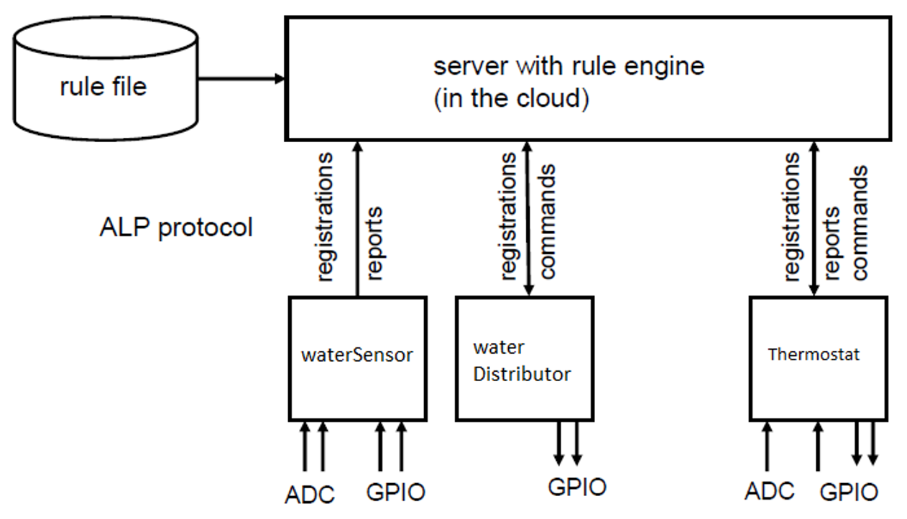

# Smart Home Proof of Concept

This is a proof of concept (PoC) project conducted for the IoT and Network Programming course at WUT. The primary objective of this project is to develop a flower care system using multiple nodes and a server to collect data from sensors and initiate appropriate actions based on the gathered information.

## Description

This is the architecture of the solution:

Sensing and actuating nodes communicate with the server via a custom-designed application layer protocol (ALP).

Additionally the server implements the rule engine for the flexibility. Rules operate over the 'smart home' domain within defined vocabularies, which consist of 'logical location type', 'object type', 'quantity type', 'state type' and 'action type'

## Authors

Adam Rogowski

[Mikołaj Blinowski](https://github.com/miko3412)

Dmytro Kirshev
